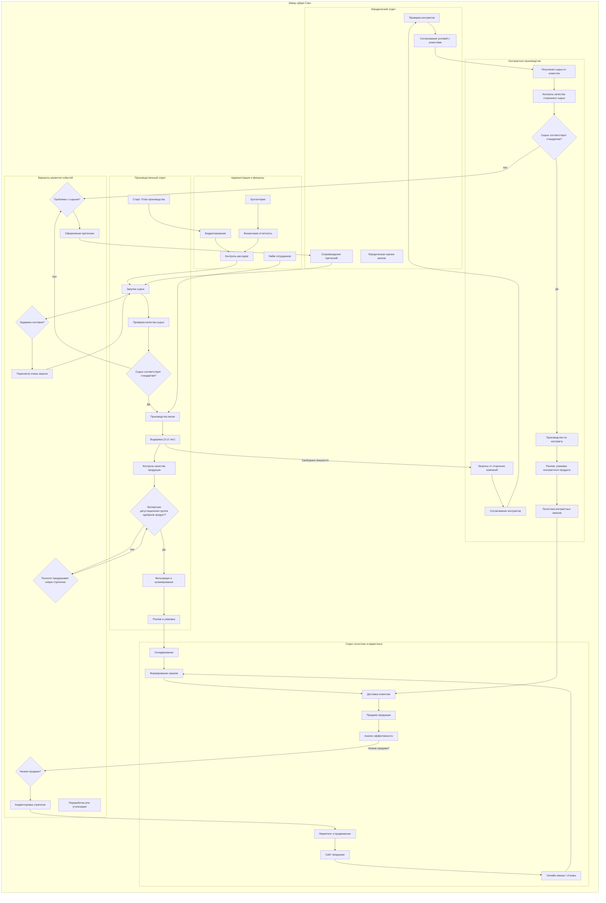

```mermaid
flowchart LR
 subgraph subGraph0["Производственный отдел"]
        A1["Старт: План производства"]
        A2["Закупка сырья"]
        A3["Проверка качества сырья"]
        A4{"Сырье соответствует стандартам?"}
        A5["Производство виски"]
        A6["Выдержка (3-12 лет)"]
        A7["Контроль качества продукции"]
        A8{"Экспертная дегустационная группа одобрила продукт?"}
        A9["Фильтрация и купажирование"]
        A10["Розлив и упаковка"]
  end

 subgraph subGraph1["Контрактное производство"]
        X1["Запросы от сторонних компаний"]
        X2["Согласование контрактов"]
        X3["Получение сырья от клиентов"]
        X4["Контроль качества стороннего сырья"]
        X5{"Сырье соответствует стандартам?"}
        X6["Производство по контракту"]
        X7["Разлив, упаковка контрактного продукта"]
        X8["Логистика контрактных заказов"]
  end

 subgraph subGraph2["Отдел логистики и маркетинга"]
        B1["Складирование"]
        B2["Формирование заказов"]
        B3["Доставка клиентам"]
        B4["Маркетинг и продвижение"]
        B5["Продажа продукции"]
        B6["Анализ эффективности"]
        B7["Сайт продукции"]
        B8["Онлайн-заказы / отзывы"]
  end

 subgraph subGraph3["Администрация и финансы"]
        C1["Бюджетирование"]
        C2["Контроль расходов"]
        C3["Бухгалтерия"]
        C4["Найм сотрудников"]
        C5["Финансовая отчетность"]
  end

 subgraph subGraph4["Варианты развития событий"]
        D1{"Проблемы с сырьем?"}
        D2["Оформление претензии"]
        D3{"Задержки поставки?"}
        D4["Пересмотр плана закупок"]
        D5{"Технолог продумывает новую стратегию"}
        D6["Переработка или утилизация"]
        D7{"Низкие продажи?"}
        D8["Корректировка стратегии"]
  end

 subgraph subGraph6["Юридический отдел"]
        J1["Проверка контрактов"]
        J2["Согласование условий с клиентами"]
        J3["Юридическая оценка рисков"]
        J4["Сопровождение претензий"]
  end

 subgraph subGraph5["Завод «Дядя Сэм»"]
        subGraph0
        subGraph1
        subGraph2
        subGraph3
        subGraph4
        subGraph6
  end

    %% Основные потоки
    A1 --> C1
    C1 --> C2
    C2 --> A2
    A2 --> A3 & D3
    A3 --> A4
    A4 -- Нет --> D1
    D1 --> D2
    D2 --> J4 --> A2
    A4 -- Да --> A5
    A5 --> A6
    A6 --> A7
    A7 --> A8
    A8 -- Нет --> D5
    D5 --> A8
    A8 -- Да --> A9
    A9 --> A10
    A10 --> B1
    B1 --> B2
    B2 --> B3
    B3 --> B5
    B5 --> B6

    %% Контрактное производство
    A6 -- Свободные мощности --> X1
    X1 --> X2
    X2 --> J1 --> J2 --> X3
    X3 --> X4
    X4 --> X5
    X5 -- Нет --> D1
    X5 -- Да --> X6
    X6 --> X7
    X7 --> X8
    X8 --> B3

    %% Альтернативные
    D3 --> D4
    D4 --> A2
    B6 -- Низкие продажи? --> D7
    D7 --> D8
    D8 --> B4

    %% Сайт и онлайн-заказы
    B4 --> B7
    B7 --> B8
    B8 --> B2

    %% Админ и финансы
    C4 --> A5
    C3 --> C5
    C5 --> C2
```