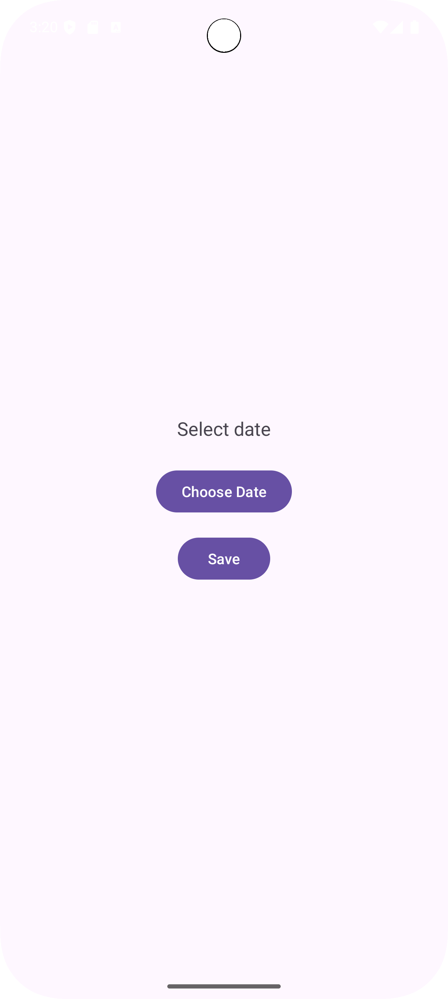
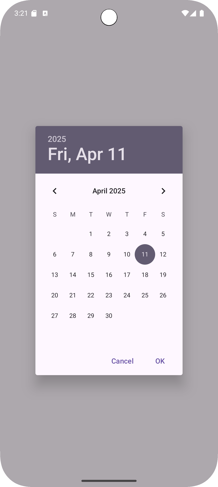
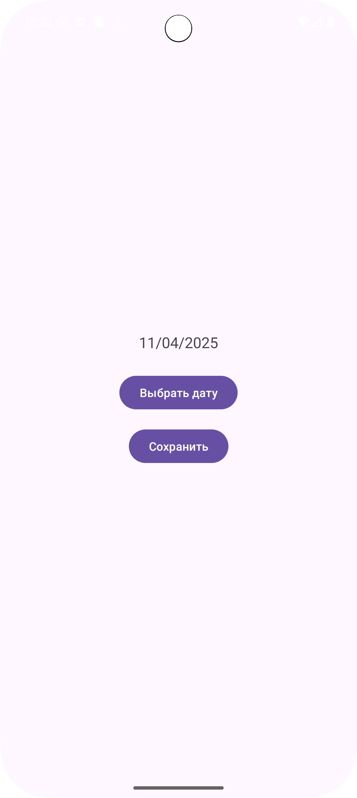
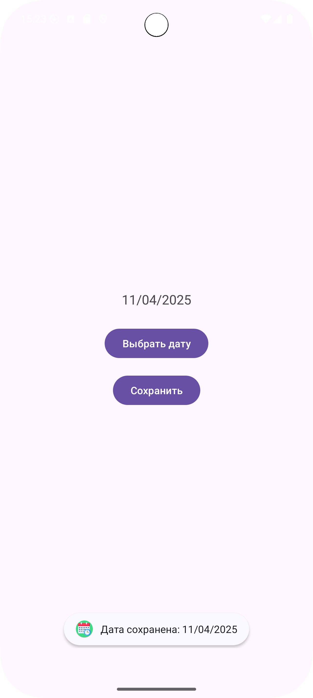

# Календарь

## Описание

Приложение представляет собой один экран, на котором пользователь может:
* Увидеть текущую выбранную дату или приглашение выбрать дату.
* Нажать кнопку для вызова стандартного диалога выбора даты (`DatePickerDialog`).
* Сохранить выбранную дату.

## Возможности

* **Выбор даты:** Использование `DatePickerDialog` для выбора года, месяца и дня.
* **Отображение даты:** Выбранная дата отображается в `TextView`.
* **Сохранение даты:** Последняя выбранная дата сохраняется в `SharedPreferences` и загружается при следующем запуске приложения.
* **Локализация интерфейса:** Тексты кнопок и меток переведены на английский и русский языки.
* **Локализация формата даты:** Формат отображения даты (`dd/MM/yyyy` или `MM/dd/yyyy`) автоматически подстраивается под язык системы (ru/en).
* **Верстка:** Использован `ConstraintLayout` для расположения элементов.
* **Пользовательская иконка:** Приложение использует иконку.

## Скриншоты

1.  **Начальный экран (Английский):**
    * Текст: "Select date"
    * Кнопки: "Choose Date", "Save"

    

2.  **Диалог выбора даты (Системный):**

    

3.  **Дата выбрана (Английский):**
    * Текст: "04/11/2025"

    

4.  **Начальный экран (Русский):**
    * Текст: "Выберите дату"
    * Кнопки: "Выбрать дату", "Сохранить"

    

5.  **Дата выбрана (Русский):**
    * Текст: "11/04/2025"
      
    

## Как собрать и запустить

1.  Клонируйте репозиторий.
2.  Откройте проект в Android Studio.
3.  Убедитесь, что у вас установлен необходимый Android SDK.
4.  Создайте или выберите виртуальное или физическое устройство.
5.  Запустите приложение.
