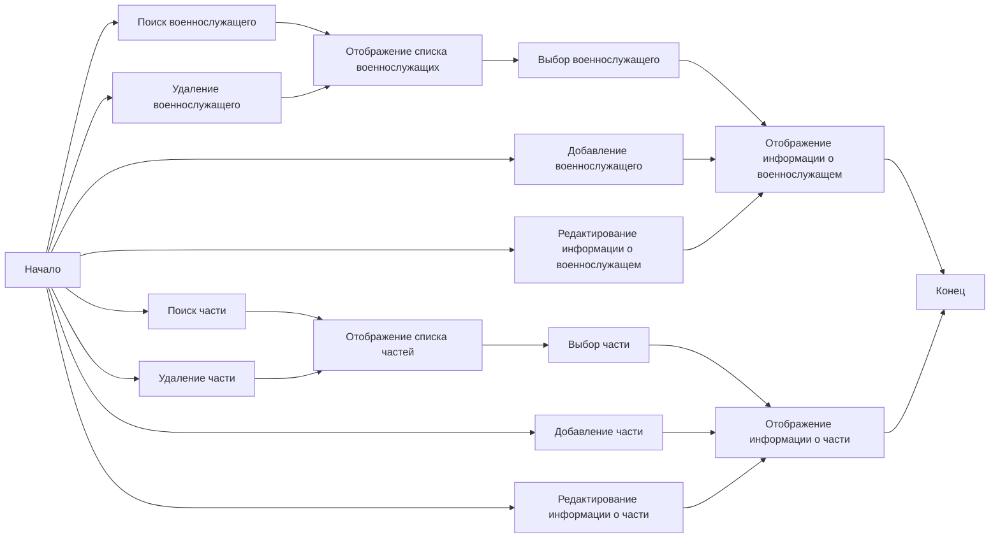

```mermaid
graph LR
  Start[Начало] --> SearchSoldier[Поиск военнослужащего]
  SearchSoldier --> DisplaySoldierList[Отображение списка военнослужащих]
  DisplaySoldierList --> SelectSoldier[Выбор военнослужащего]
  SelectSoldier --> DisplaySoldierInfo[Отображение информации о военнослужащем]
  DisplaySoldierInfo --> End[Конец]

  Start --> AddSoldier[Добавление военнослужащего]
  AddSoldier --> DisplaySoldierInfo

  Start --> EditSoldier[Редактирование информации о военнослужащем]
  EditSoldier --> DisplaySoldierInfo

  Start --> DeleteSoldier[Удаление военнослужащего]
  DeleteSoldier --> DisplaySoldierList

  Start --> SearchDepartment[Поиск части]
  SearchDepartment --> DisplayDepartmentList[Отображение списка частей]
  DisplayDepartmentList --> SelectDepartment[Выбор части]
  SelectDepartment --> DisplayDepartmentInfo[Отображение информации о части]
  DisplayDepartmentInfo --> End

  Start --> AddDepartment[Добавление части]
  AddDepartment --> DisplayDepartmentInfo

  Start --> EditDepartment[Редактирование информации о части]
  EditDepartment --> DisplayDepartmentInfo

  Start --> DeleteDepartment[Удаление части]
  DeleteDepartment --> DisplayDepartmentList

```