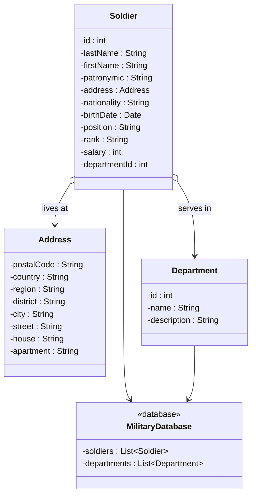

```mermaid
classDiagram
class MilitaryDatabase {
  <<database>>
  -soldiers : List~Soldier~
  -departments : List~Department~
}

class Soldier {
  -id : int
  -lastName : String
  -firstName : String
  -patronymic : String
  -address : Address
  -nationality : String
  -birthDate : Date
  -position : String
  -rank : String
  -salary : int
  -departmentId : int
}

class Address {
  -postalCode : String
  -country : String
  -region : String
  -district : String
  -city : String
  -street : String
  -house : String
  -apartment : String
}

class Department {
  -id : int
  -name : String
  -description : String
}

Soldier --> MilitaryDatabase
Department --> MilitaryDatabase
Soldier o--> Address : lives at
Soldier o--> Department : serves in

```